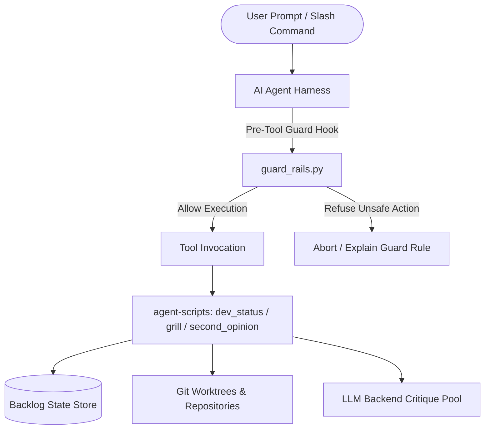
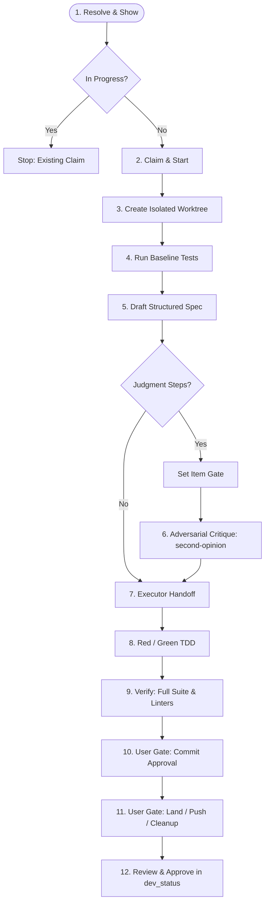
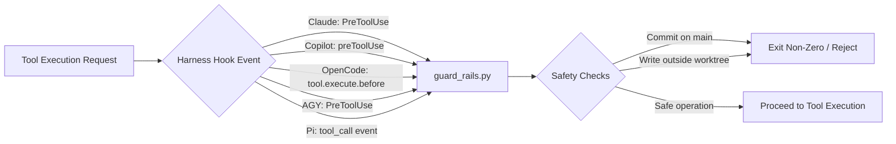
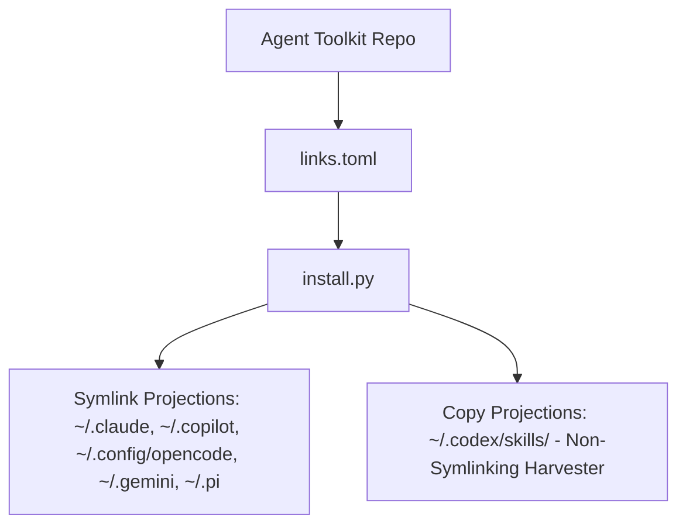
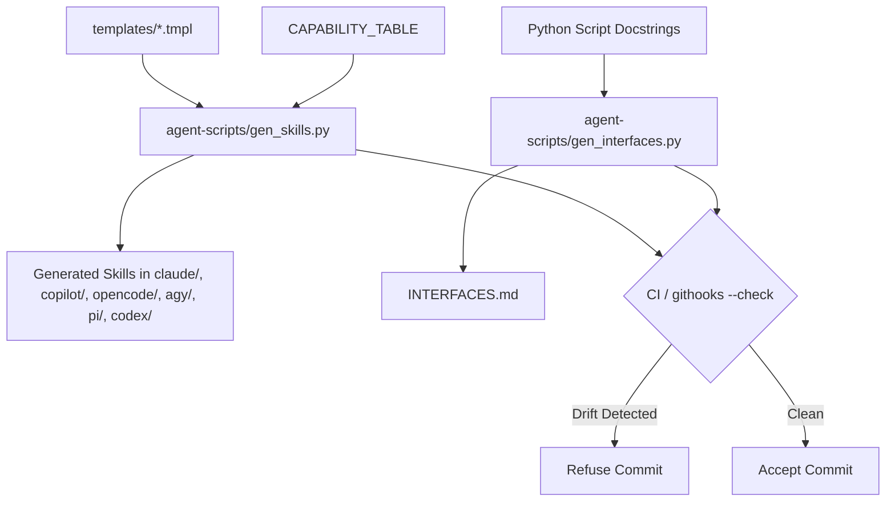

# Architecture: System Overview & Lifecycle Flows

This document provides a comprehensive architectural map of the **Agent Toolkit**,
its cross-harness abstractions, core components, and primary lifecycle workflows.

---

## 1. System Overview & Core Principles

Agent Toolkit provides a unified, cross-platform harness environment for AI-assisted
engineering across six supported harnesses:
- **Claude Code** (Anthropic)
- **GitHub Copilot CLI** (GitHub)
- **OpenCode** (Local / Multi-provider TUI)
- **Google Antigravity (AGY)** (Google DeepMind)
- **Pi** (Lightweight extensible terminal assistant)
- **Codex CLI** (OpenAI)

### Key Architectural Principles

1. **Active Parity Across Harnesses**: Standardized skills and commands behave identically across all six harnesses, maintained by automated generators rather than manual per-harness duplication (see [AGENTS.md](../../AGENTS.md)'s "Harness maintenance tiers").
2. **Progressive Disclosure**: Information is tiered to preserve context budgets (Tier 1 Root Index, Tier 2 Directory Instructions & Hazards, Tier 3 Task Skills & Prompts; see [progressive-disclosure-rubric.md](progressive-disclosure-rubric.md)).
3. **Worktree-First Isolation**: All non-trivial code modifications run in dedicated git worktrees, preventing branch contamination, stale dependency clashes, and concurrent agent collisions on `main`.
4. **Deterministic Pre-Tool Guard Rails**: Active task checkouts and sensitive git operations are protected by harness-level pre-tool hooks (`guard_rails.py`) and repository pre-commit hooks.

---

## 2. Component Map & Directory Layout

The repository is structured into distinct functional layers:

```
┌────────────────────────────────────────────────────────────────────────┐
│                          User & Harness Layer                          │
│  Claude Code  │  Copilot CLI  │  OpenCode  │  AGY  │  Pi  │  Codex CLI │
└───────┬──────────────┬──────────────┬─────────┬───────┬──────────┬─────┘
        │              │              │         │       │          │
┌───────▼──────────────▼──────────────▼─────────▼───────▼──────────▼─────┐
│                 Generated Skills & Harness Adapters                    │
│   claude/   │   copilot/   │   opencode/   │  agy/  │ pi/ │ codex/   │
└──────────────────────────────────┬─────────────────────────────────────┘
                                   │
┌──────────────────────────────────▼─────────────────────────────────────┐
│                         Core Backend Scripts                           │
│  dev_status.py  │  grill.py  │  second_opinion.py  │  refresh_guidance │
└───────┬──────────────────────────┬───────────────────────────┬─────────┘
        │                          │                           │
┌───────▼──────────┐      ┌────────▼─────────┐        ┌────────▼─────────┐
│ State & Backlog  │      │ Git & Worktrees  │        │ Remote / Bridge  │
│  dev_status.json │      │  guard_rails.py  │        │   herdr_remote/  │
│  grill data/logs │      │  githooks/       │        │   (Web PWA/SSE)  │
└──────────────────┘      └──────────────────┘        └──────────────────┘
```

### Directory Roles

- **`agent-scripts/`**: Standard-library-only Python tools implementing core workflow logic (`dev_status.py`, `grill.py`, `second_opinion.py`, `refresh_guidance.py`) and artifact generators (`gen_skills.py`, `gen_interfaces.py`, `gen_second_opinion.py`).
- **`claude/`**, **`copilot/`**, **`opencode/`**, **`agy/`**, **`pi/`**, **`codex/`**: Harness-specific configuration adapters, prompts, slash commands, and plugins mapped into user environments via [links.toml](../../links.toml).
- **`pi/`**: TypeScript ecosystem for the Pi assistant, housing custom extensions (such as `question-tool.ts` and `swarm-tool.ts`) with dedicated Node test suites (run through `node:test` + the `expect` package).
- **`herdr_remote/`**: Independent remote-control bridge daemon (`aiohttp`) and static PWA for monitoring and prompting headless agent sessions over Tailscale (see [herdr-remote.md](herdr-remote.md)).
- **`githooks/`**: Repository pre-commit hooks preventing direct commits on `main`, enforcing seed SessionStart hook retention, and verifying documentation freshness.
- **`test/`**: Pytest suite operating under a sandboxed `HOME` environment with mocked subprocess calls to verify installer, guards, and link invariants.

---

## 3. High-Level Architecture Flow



---

## 4. Core Lifecycle Flows

### Lifecycle 1: `/backlog-item` Gated Execution

The `/backlog-item` workflow governs structured, test-driven implementation of tasks with mandatory verification gates.



- **Resolution & Claim**: Loads the record via `dev_status.py show <slug>`. Prevents conflicting concurrent execution by inspecting and claiming ownership.
- **Worktree Isolation**: Allocates a fresh worktree (`../<repo>-<slug>`) and bootstraps local dependencies (`bootstrap-worktree.sh`).
- **Spec & Gate Classification**: Tasks involving design choices or requirement interpretation trigger gate criteria (`gate-set`) and require an adversarial critique pass (`second_opinion.py`).
- **Explicit Approval Gates**: Commits and repository merges require mandatory, separate user approval pauses.

The Pi and Copilot queue runners wrap this same lifecycle rather than replacing
it. `herdr_delegate.py` starts one orchestrator, while the shared TypeScript
scheduler re-reads `dev_status.py ready --prefix` after each terminal worker.
Concurrent mode admits only `worker_safe` items up to its configured cap;
serial mode admits only `serial_safe` items, holds exactly one worker or relay
tab, and waits for confirmed teardown before advancing through the dynamic
topological READY frontier. Attempted and permanently refused items are
persisted per run, and approval relays and capture offers retain the ordinary
backlog-item gates.

---

### Lifecycle 2: Automated Guard Rails & Pre-Tool Enforcement

Guard rails intercept agent tool execution at runtime to prevent accidental repo corruption, unisolated modifications, and dirty commits.



- **Main Checkout Protection**: Blocks commands attempting `git commit` directly within a root/main checkout when an active backlog task requires a worktree.
- **Dangerous Operations Guard**: Detects recursive deletes (`rm -rf`) against sensitive or non-worktree paths.
- **Git Commit Target Resolution**: Resolves `-C`, chained `cd`, and subshell environments to verify the true git target repository before permitting a commit.
- **Pre-Commit Hook Interception**: Git-level pre-commit hook verifies generated interfaces and prevents lossy rewrites of hook groups.

---

### Lifecycle 3: Settings Drift & Link Management

The toolkit uses a single manifest-driven system to synchronize configuration, instructions, and skills into harness configuration trees.



- **Manifest Contract (`links.toml`)**: Maps repository source paths to target home directory locations across harnesses.
- **Symlink vs. Copy Mechanics**: Most harnesses consume live symlinks (`120000` mode), allowing instant development reflection. Harnesses that refuse symlink resolution (e.g., Codex CLI's skill harvester) receive direct file copies via `sync_codex_skills()`.
- **Instruction Pairing (`AGENTS.md` + `CLAUDE.md`)**: Subtrees maintain a canonical `AGENTS.md` paired with a sibling `CLAUDE.md` symlink to satisfy conflicting harness discovery requirements.

---

### Lifecycle 4: Cross-Harness Code Generation & Synchronization

To eliminate drift across six divergent harness skill formats, documentation and skills are compiled from shared templates and source docstrings.



- **Template Compilation**: `gen_skills.py` evaluates harness capabilities (e.g., whether a structured question widget exists or plain text is required) and emits harness-tailored skill definitions.
- **Interface Introspection**: `gen_interfaces.py` introspects `argparse` definitions and docstrings across `agent-scripts/`, maintaining `INTERFACES.md` as a live reference.
- **Integrity Enforcement**: `python3 agent-scripts/gen_interfaces.py --check` runs during testing and pre-commit checks, failing immediately if documented contracts diverge from implementation.

---

## 5. Related Documentation & References

- [AGENTS.md](../../AGENTS.md): Repository standards, worktree setup, and harness parity guidelines.
- [README.md](../../README.md): Quick start, installation, harness setup notes, and command catalog.
- [STYLE.md](../../STYLE.md): Engineering standards, type annotations, and CLI ergonomics.
- [INTERFACES.md](../../INTERFACES.md): Complete interface inventory of all scripts and generators.
- [progressive-disclosure-rubric.md](progressive-disclosure-rubric.md): Guidelines for structuring multi-tier repository guidance.
- [herdr-remote.md](herdr-remote.md): Architecture documentation for the remote-control HTTP bridge and PWA.
